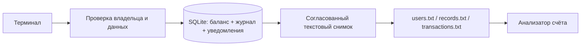

# teller-system

[](https://github.com/ernat-soltanbekov/teller-system/actions/workflows/ci.yml)

Терминальная система управления учебными банковскими счетами на C11.
Регистрация, управление счетами, операции, передача владельца и анализ расходов
работают с постоянным хранением. Все бонусы ТЗ реализованы: подробная статистика,
уведомления между открытыми сессиями, хеширование паролей, SQLite, улучшенное меню,
Makefile и дополнительные проверки восстановления после сбоев.

Автор и владелец: [Yernat «GhostOfAstana» Soltanbekov](https://github.com/ernat-soltanbekov).
Военное прошлое, ежедневная утренняя практика боевых искусств с 2008 года,
техническое образование и обучение в Tomorrow School определяют подход:
дисциплина, ясность и проверка каждого существенного действия.
Профессиональная цель — присоединиться к команде Astana Hub МИИЦР РК.
Проект личный; деньги, ставки и учётные записи здесь учебные.

## Запуск

Нужны компилятор C11, Make, pkg-config, SQLite ≥3.25 и OpenSSL ≥3.
Поддерживаются Linux и macOS. Python 3.9+ нужен только для внешнего аудита.

```sh
git clone https://github.com/ernat-soltanbekov/teller-system.git
cd teller-system

# Ubuntu / Debian, если библиотек ещё нет:
sudo apt-get install build-essential pkg-config libsqlite3-dev libssl-dev

make
./teller-system
```

На macOS с установленными Command Line Tools:

```sh
brew install pkgconf openssl@3 sqlite
export PKG_CONFIG_PATH="$(brew --prefix openssl@3)/lib/pkgconfig:$(brew --prefix sqlite)/lib/pkgconfig"
make
./teller-system
```

`./atm` — совместимое имя той же программы. Сборка не скачивает библиотеки.
Приложение работает локально и не обращается к сетевым сервисам.

Демонстрационные пользователи из стартового проекта:

| Имя | Пароль для учебного входа |
| --- | --- |
| `Alice` | `q1w2e3r4t5y6` |
| `Michel` | `q1w2e3r4t5y6` |

Это публичные демонстрационные данные. Даже их пароли в `data/users.txt`
уже записаны хешами с разными солями. Можно зарегистрировать своего пользователя.
Новый пароль должен иметь 8–128 символов. Имена уникальны без учёта регистра:
повторная регистрация `Alice` или `alice` отклоняется.

Для отдельного набора данных:

```sh
./teller-system --data-dir /tmp/my-teller-data
./teller-system --data-dir /tmp/my-teller-data --check
./teller-system --help
```

Пустой каталог создаёт пустую базу, в которой сначала нужно зарегистрироваться.
Первая загрузка `data/` импортирует прилагаемые учебные записи автоматически.

## Меню

После входа:

| Пункт | Действие |
| --- | --- |
| 1 | Создать счёт: дата, номер, страна, телефон, начальный баланс, тип |
| 2 | Обновить только телефон или страну выбранного своего счёта |
| 3 | Показать один счёт, проценты, классификацию и подробную статистику |
| 4 | Показать таблицу своих активных счетов |
| 5 | Внести или снять деньги; fixed-счета запрещают обе операции |
| 6 | Удалить счёт из активных после подтверждения `YES` |
| 7 | Передать счёт другому зарегистрированному пользователю после `YES` |
| 8 | Выйти из учётной записи |
| 9 | Показать историю уведомлений |
| 0 | Завершить программу |

Операции возвращают в меню без рекурсивных вызовов. EOF завершает сеанс;
Ctrl+C и SIGTERM восстанавливают эхо терминала, если вводился пароль.
При ошибке ввода или бизнес-правил показывается причина, данные не меняются.

Номер счёта — целое число от 0 до 2147483647, уникальное во всей системе.
Страна и имя — один токен из ASCII-букв, цифр, `_` и `-`, до 48 символов.
Например, `United_Kingdom`. Телефон содержит 3–20 цифр с необязательным `+`;
ведущие нули сохраняются. Даты — `dd/mm/yyyy`, годы 1900–9996, с проверкой календаря.
Денежный ввод — десятичная сумма с максимум двумя знаками после точки;
отрицательные значения, `NaN`, экспоненциальная запись и лишние знаки запрещены.
Предел баланса — $100 000 000 000.00. Сумма операции строго положительная.

## Проценты и анализ

Ставки взяты из ТЗ; начисление здесь показывается как расчёт, не как автоматическая
операция по балансу. Все деньги хранятся целым числом копеек. Результат процентов
округляется до ближайшей копейки, половина — вверх.

| Тип | Расчёт | Для $1001.20 от 10/10/2012 |
| --- | --- | --- |
| savings | Баланс × 7% / 12 | $5.84 на 10-е число каждого месяца |
| fixed01 | Баланс × 4% × 1 год | $40.05 на 10/10/2013 |
| fixed02 | Баланс × 5% × 2 года | $100.12 на 10/10/2014 |
| fixed03 | Баланс × 8% × 3 года | $240.29 на 10/10/2015 |
| current | Процентов нет | Точное сообщение из ТЗ |

Для даты 29 февраля срок в невисокосном году заканчивается 28 февраля.
Расчёт savings сообщает день создания счёта, как требует задание.

`src/analyzer.c` реализует `analyze_spending(int account_id)`: открывает
`transactions.txt`, проверяет записи, выбирает указанный номер счёта и считает:

```text
ratio = round(total_deposited / (total_deposited + total_withdrawn) × 100)
60–100% → saver
40–59%  → moderate
0–39%   → spender
```

Округление выполняется **до** выбора категории, целочисленно: 59.6% → 60% →
`saver`, 59.4% → 59% → `moderate`, 39.5% → 40% → `moderate`.
Если операций нет, выводится ровно `No transaction history available.`
Повреждённый журнал даёт ошибку, а не выдуманную классификацию.

Пример бонусного вывода:

```text
Spending pattern: saver
You tend to deposit more than you withdraw. Keep it up!

Transaction breakdown: 2 deposits ($700.00) | 1 withdrawals ($100.00) | ratio: 88%
```

Начальный баланс — исходное состояние счёта; операции в журнале появляются
при выборе Deposit/Withdrawal после открытия. Это позволяет корректно
анализировать период после начального остатка и сохраняет поведение
импортированных счетов без истории. Начальная сумма не добавляется в журнал
повторно. Для целочисленного расчёта сумма всех сумм операций одного счёта
ограничена `INT64_MAX / 101` копейками.

## Хранение и восстановление

SQLite — основной источник данных; `users.txt`, `records.txt` и
`transactions.txt` — синхронизированные текстовые представления в формате ТЗ.
Они остаются доступными обычным `cat`, редактору и аудиторским скриптам.



При изменении баланс, журнал и уведомления сохраняются одной SQL-транзакцией.
Новые текстовые файлы заранее записываются и синхронизируются; после COMMIT
ссылка `.current` переключается на готовый снимок через `rename`.
Три публичных `.txt` ссылаются на него. Обычный успешный ответ означает,
что сохранены и база, и текстовые представления.

Если процесс погиб после COMMIT, но до переключения `.current`, база уже
содержит операцию, а файлы могут показывать предыдущий снимок. Следующий запуск
восстановит файлы из SQLite. Уже открытая сессия тоже проверяет версию перед
изменениями и просмотром подробностей. Нельзя одновременно атомарно зафиксировать
SQLite и файловую ссылку; этот промежуток явно обработан восстановлением.

```sh
./teller-system --check    # Проверить базу, баланс/журнал и восстановить текст
./teller-system --export   # Пересоздать представления из SQLite
```

Ошибка до COMMIT откатывает операцию. Ошибка публикации после COMMIT сообщает
`Saved in SQLite ... Do not repeat. Restart to recover.` и завершает сеанс,
чтобы пользователь не повторил уже сохранённый перевод или платёж.
Проверки включают четыре аварийные остановки на разных этапах записи.

Не редактируйте текстовые снимки для изменения живой базы: при следующем запуске
они будут восстановлены. Для резервной копии используйте SQLite backup API или
согласованный снимок всего каталога при закрытых сессиях; файлы WAL — часть базы.
Текстовый экспорт показывает активные счета, поэтому он не заменяет полный backup.

Удалённые счета скрываются из списка и `records.txt`; их исходные записи и
операции сохраняются в SQLite как архив. Номер архивного счёта не переиспользуется.
При передаче владельца номер, баланс и история остаются у счёта, а прежний
владелец немедленно теряет доступ через приложение.

## Живые уведомления

Откройте два терминала с **одним и тем же** `--data-dir`. В одном войдите как
получатель, например Laura, и оставьте меню открытым. Во втором передайте ему
счёт. Получатель увидит уведомление без нажатия Enter; ожидание ввода проверяет
события каждые 200 мс. Эта цифра — интервал опроса, а не гарантия жёсткого
реального времени при перегрузке ОС. Уведомления сохраняются в базе и доступны
после входа через пункт 9. Внутри сеанса уже показанные события не повторяются
при автоматическом опросе.

## Проверки

```sh
make test       # Модульные тесты C
make audit      # Внешний аудит настоящих исполняемых файлов
make sanitize   # Модульные тесты с ASan + UBSan
make analyze    # Статический анализ Clang
make stress     # Миллион воспроизводимых мутаций под ASan + UBSan
make check      # test + audit + sanitize
```

На Linux с Clang и установленным libFuzzer (`libclang-rt-dev`):

```sh
make fuzz       # 15 секунд coverage-guided fuzzing
```

Apple Command Line Tools могут не включать runtime libFuzzer; для них работает
`make stress`. CI запускает полный аудит с GCC и Clang на Linux, включая
LeakSanitizer, а также отдельную сборку и аудит на macOS.

Все тесты работают в своих временных каталогах и не меняют пользовательский `data/`.
Подробности: [карта аудита](docs/AUDIT.md), [архитектура и разбор для защиты](docs/ARCHITECTURE.md),
[измеренные результаты](docs/VALIDATION.md).

## Происхождение и границы

Проект опирается на [официальный ATM starter](https://assets.01-edu.org/atm-system/atm-system.zip).
Контрольная сумма архива — в [starter-source.json](docs/starter-source.json).
Сохранены предметная модель и основные пользовательские сценарии; исправлены
разбор записей, возврат указателя на локальную память, работа с паролями,
небезопасный ввод, рекурсивное меню и запись денежных значений.
Старое `saving` нормализуется в `savings`, лишние нулевые десятичные знаки
импортируются без потери копеек, обычные старые пароли преобразуются в хеши.

PBKDF2-HMAC-SHA256 использует 600 000 итераций, случайную соль 16 байт и ключ
32 байта. Соль получается через `RAND_bytes`, проверка — через `CRYPTO_memcmp`.
Используется [реализация OpenSSL](https://docs.openssl.org/3.0/man3/PKCS5_PBKDF2_HMAC/).
Новые приватные файлы имеют права 0600, каталоги снимков — 0700.

База не зашифрована; владелец каталога на уровне ОС может читать и менять данные.
Поддерживается один доверенный локальный каталог и несколько процессов приложения
на одном компьютере. Сетевые файловые системы и недоверенный общий каталог не
являются поддерживаемым режимом. Импорт и анализ текстовой истории ограничены
16 MiB на файл; это учебная система, а не обработчик неограниченного потока.
Тесты не заменяют независимый аудит безопасности или устную защиту задания.
